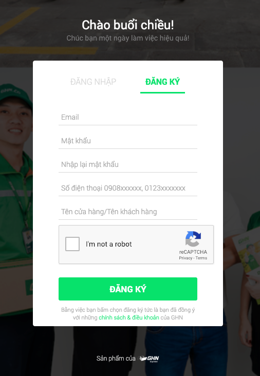

# Getting Started

**Before connecting with Giaohangnhanh.vn carrier \(GHN Express\), the Shopify merchant must complete  two conditions:**

* Verify or adding business settings for your store: enter the full address, mobile phone, especially the information of the province/city, the district must be fully updated. Switch store currency to Vietnamese đồng \(VND\)
* Have GHN Express account or [register a Giaohangnhanh account here](https://5sao.ghn.vn/Register).

### 1. Verify business settings for your store

The GHN App use your business setting detail to apply default **merchant** store address, phone number ... in delivery requirement. Before you start setting up GHN App, you must check & verify your business setting for your store.

* Store name **\(\*\)**
* Customer-facing email address
* Phone **\(\*\)**
* 🇻🇳 Legal business name and address **\(\*\): the address must be in Vietnam**
* Store timezone : GMT +7
* Default store currency **\(\*\)**: **Vietnamese đồng \(VND\)**
* Default weight unit: **Gram \(g\) -** Unit system: Metric System

\(\*\): Information Required

You may read more detail how to change your business settings here: [https://help.shopify.com/en/manual/intro-to-shopify/initial-setup/setup-business-settings](https://help.shopify.com/en/manual/intro-to-shopify/initial-setup/setup-business-settings)

### 2. Register GHN Express account. 

Here are the steps to help you register for GHN's service account

**Step 1:** Go to [https://5sao.ghn.vn/Register](https://5sao.ghn.vn/Register)

**Step 2:** Fill the detail in Register form

**Step 3:** Check your email and click verify link with GHN link and start to use the GHN Express service

