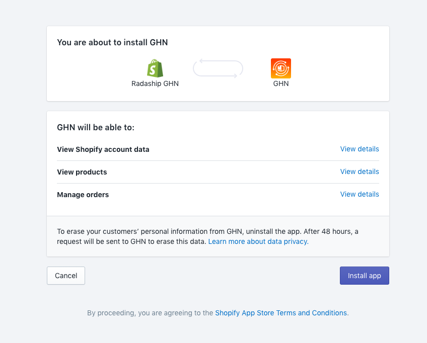
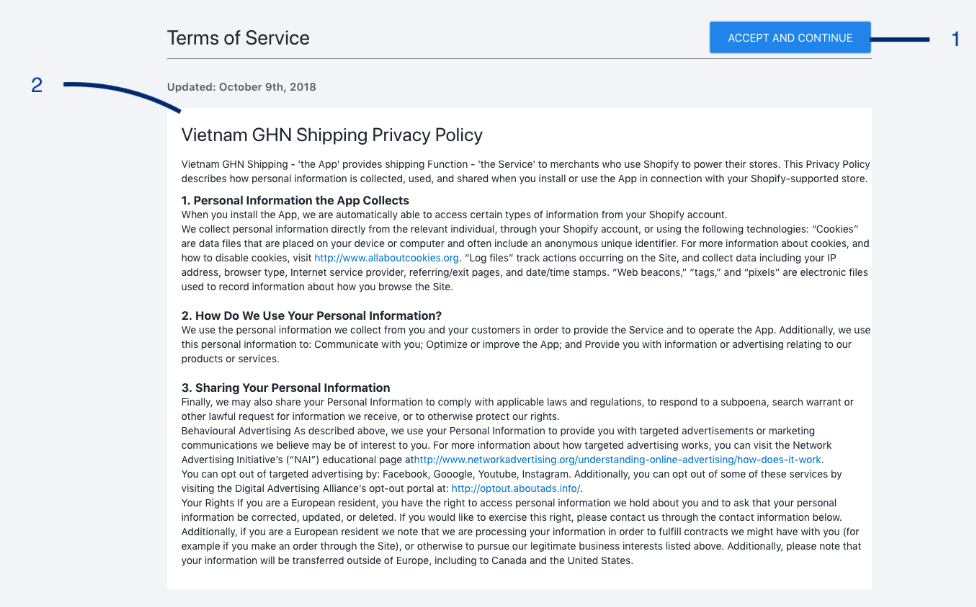

# Installing a Shopify App

**Step 1**: Go to the [App Store](https://apps.shopify.com/), and choose the app you’d like to install. 

**Step 2**: Click the **Add App** button. 

**Step 3**: Log into the App Store. 

**Step 4**: Confirm App installation by click **Install App**.

**Step 5**: Use the app! Your newly installed app will live in the App section of your Shopify Admin.

From your Shopify admin, go to **Apps.** Click **GHN.** 


To help with GDPR compliance, and gain merchant trust through clarifying exactly how merchant and buyer data is being used, the app privacy policy will be display at the first time you using the app. Please read it carefully.


