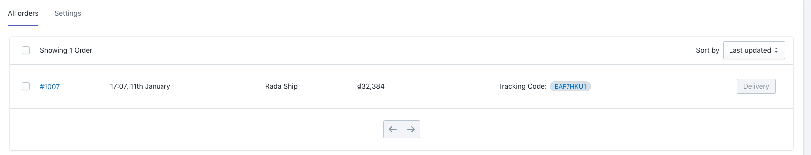
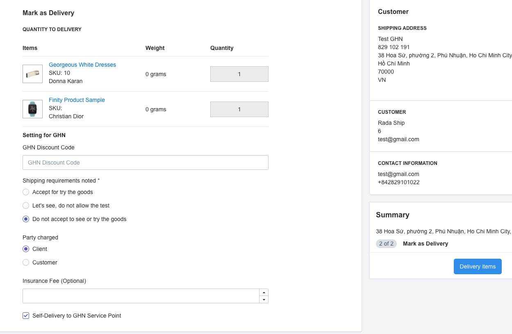
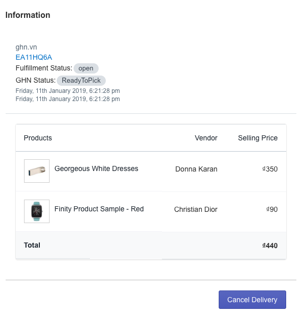
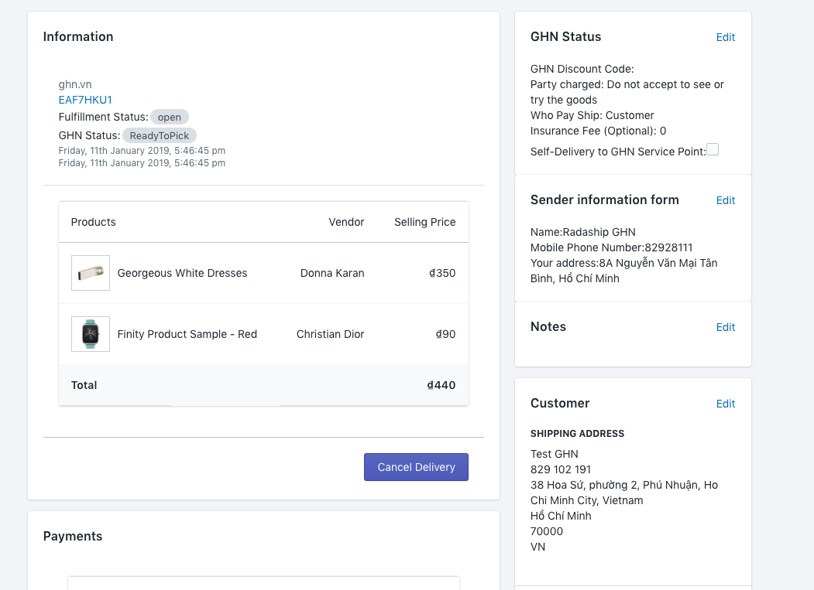
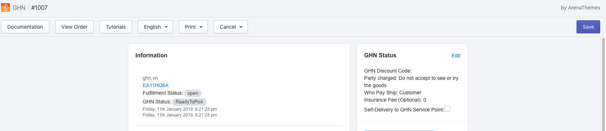
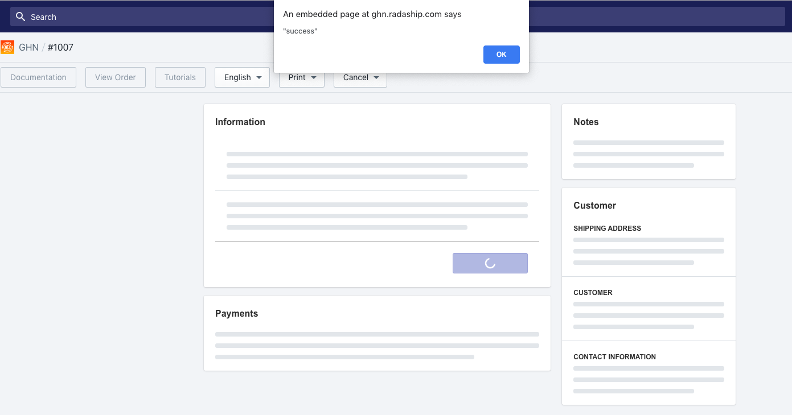

# Processing delivery your orders

GHN Express offers a number of optional services for shipping orders so you should consult and edit these options before starting.

### 1. GHN Optional Services Setting

**Steps 1:** From GHN app dashboard go to **Settings**

**Step 2:** Enter or edit your settings

* GHN Discount Code
* Party charged \(\*\)
* Shipping requirements noted
* Self-Delivery to GHN Service Point

**Step 3**: Click **Save**

The app ready to transfer your shop order to GHN Express

### 2. Process the order transfer to GHN Express

After successfully connecting with the GHN Express carrier, ****and complete GHN Express service settings, the merchant can process the **order confirmation** so that the order will transfer to GHN Express processing the delivery.

In order to **confirm the order to process delivery** the merchant can do it through 2 ways:

#### 2.1. Fast execution confirm delivery

If the order information is correct and nothing changes, you can manipulate quick order confirmation through the steps.

**Step 1:** In **GHN app dashboard** \(from your Shopify admin, go to **Apps.** Click **GHN\), find** the order you need to .

**Step 2:** Click **Delivery** button to process your order transfer to GHN Express

**Step 3:** Your order now ready to ship. **GHN Express tracking code** will show up at order detail.

#### 2.2. Custom execution confirm process delivery

May apply when:

* **Check your order information** or **edit your order information** before process transfer the order to GHN Express
* Custom GHN Express Optional Service for this particular order.

**Step 1:** In **GHN app dashboard** click to the order you need to confirm.

**Step 2:**  The order detail will show up and you can check the information and click **Edit** to change **Customer** or Shipping **Note** 

**Step 3:** When your confirm process successfully, Click **Mark as Delivery**

**Step 4:** Verify & Edit **GHN Express Optional Service** this particular order.

**Step 5:** Click **Delivery items** to process transfer the order to GHN Express.

**Step 6.** GHN Tracking code will show up with detail

### 3. **Update order delivery detail when order has been sent to GHN Express to processing**

May apply when:

* Order detail that has been sent to GHN Express for processing. However,  **GHN Express has not yet begun their work.**

**Step 1:** In **GHN app dashboard** click to the order you need to update detail.

**Step 2:**  The order detail will show up and you can check the information and click **Edit** to change **Customer** or Shipping **Note** 

**Step 3:** Edit the detail and click Save button

**Step 4:** Click **Save** button at the top right side of the app to update delivery detail

Now your order delivery detail has been updated

### 4. Cancel Delivery Processing

May apply when:

* Order detail that has been sent to GHN Express for processing. However, **GHN Express has not yet begun their work.**

**Step 1:** In **GHN app dashboard** click to the order you need to cancel delivery process 

**Step 2:**  The order detail will show up and you can Cancel delivery process by click **Cancel Delivery** button

**Step 3**: You delivery request will be cancelled.

