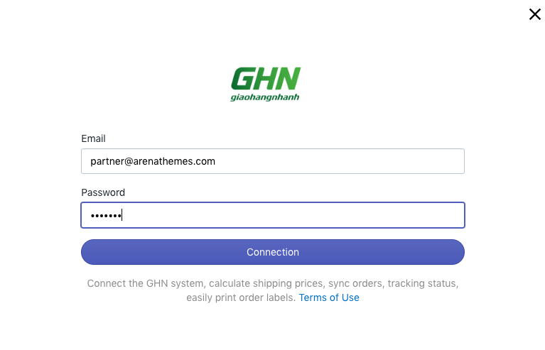
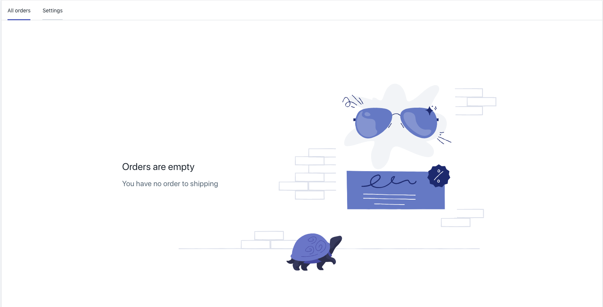

# Integrating GHN Express with Shopify GHN App

After installing the **GHN app**, you must connect the application to your **GHN Express account.**

**Step 1:** From your Shopify admin, go to **Apps.** Click **GHN.**

**Step 2:** Click **Connect GHN Account**

**Step 3:** Enter your [**GHN Express account detail** ](http://doc.radaship.com/#register)and click **Connection**

**Step 4:** So, the shop has successfully linked and started using GHN Express carrier service from the app dashboard.

#### Merchant customer now can access Shipping method.

