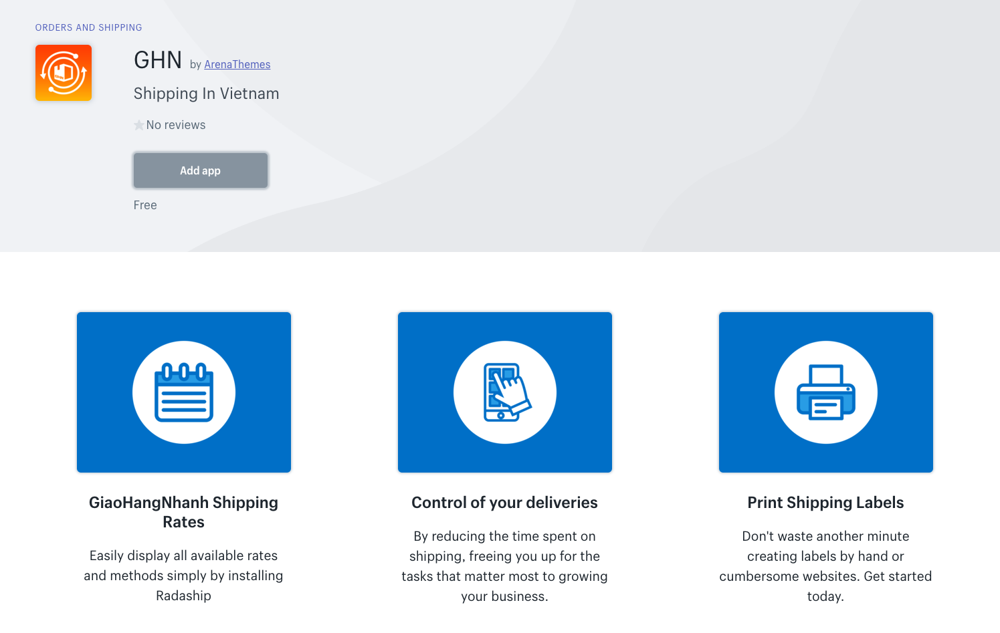
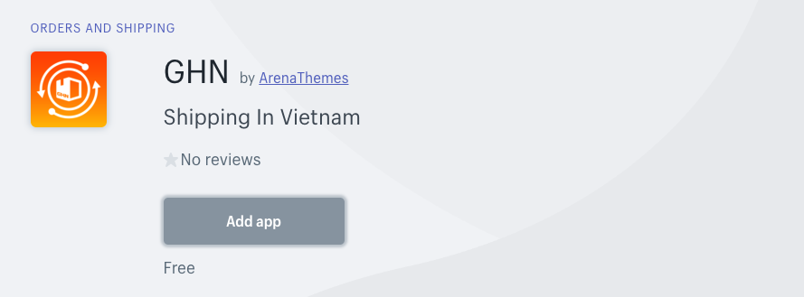
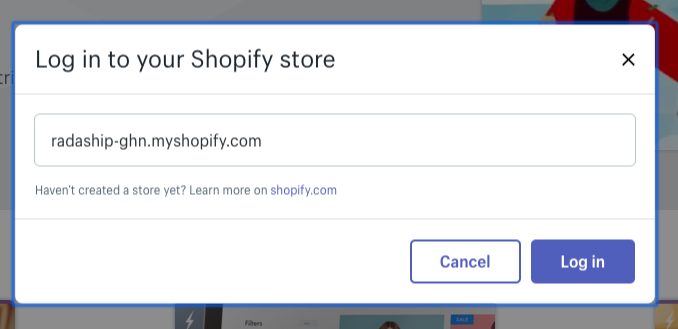
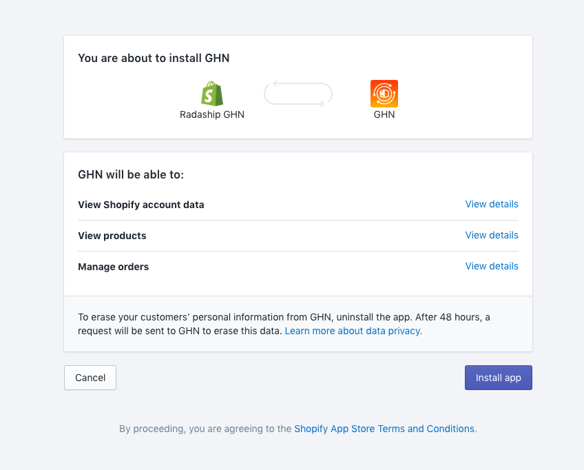
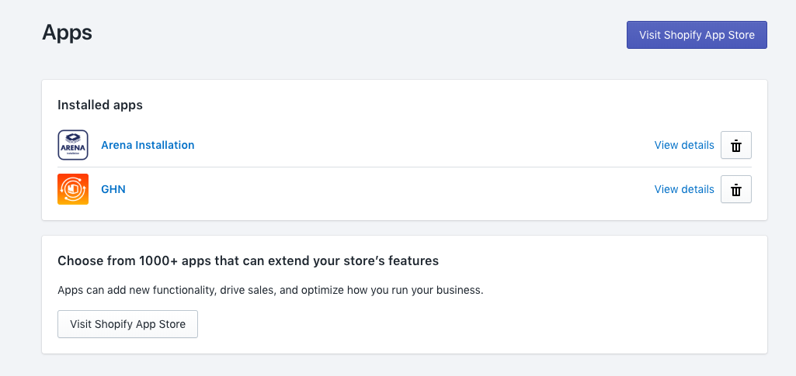
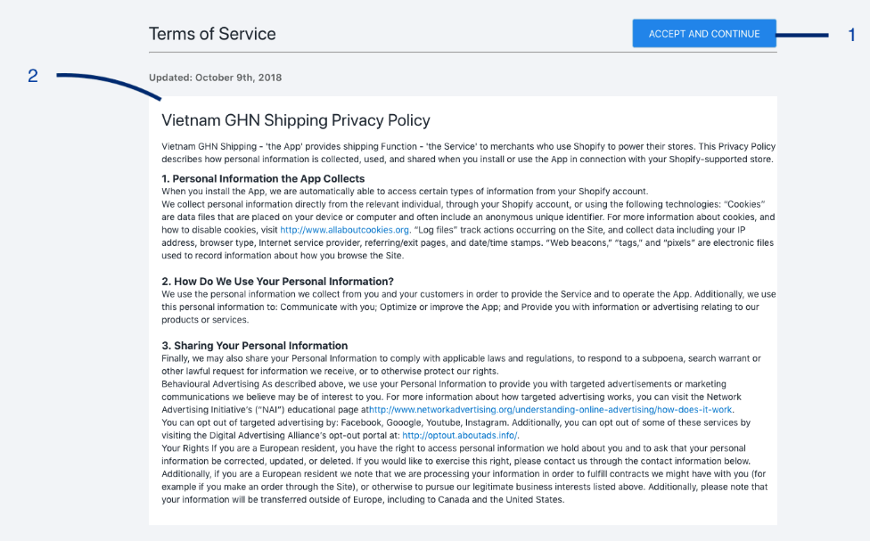
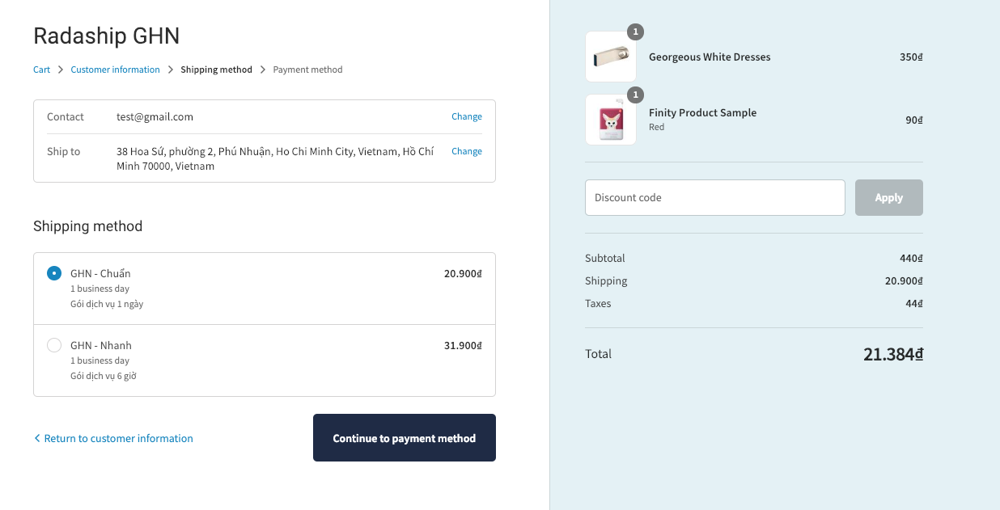

# Cài đặt ứng dụng Shopify

**Bước 1**: Truy cập  [App Store](https://apps.shopify.com/) tìm kiếm và lựa chọn ứng dụng bạn cần cài đặt.  

**Bước 2**: Nhấn click chuột trái  **Add App** để cài 

**Bước 3**: Điền thông tin địa chỉ cửa hàng Shopify của bạn và nhấn chuột trái vào Log in sau đó điền thông tin đăng nhập để cài đặt.

**Bước 4**: Xác nhận cài đặt ứng dụng bằng cách nhấn chuột trái  **Install App**.

**Step 5**: Bắt đầu sử dụng ứng dụng. Ứng dụng sẽ xuất hiện trong Shopify dashboard quản lý của bạn.

Từ trang quản  Shopify admin, vào phần **Apps**, chọn vào **GHN**


Để tuân thủ các điều kiện bảo mật GDPR compliance, và có được sự tin tưởng của người  thông qua việc làm rõ chính xác cách sử dụng dữ liệu của nhà phát triển đối với dữ liệu của người dùng , chính sách bảo mật của ứng dụng sẽ được hiển thị ở lần đầu tiên bạn sử dụng ứng dụng. Xin vui lòng đọc nó một cách cẩn thận.


Sau khi cài đặt ứng dụng, khách hàng của bạn đã có thêm sự lựa chọn phương pháp ship mới từ GHN Express. Mức phí vận chuyển sẽ được GHN  tính dựa trên thông tin khách hàng cung cấp.

