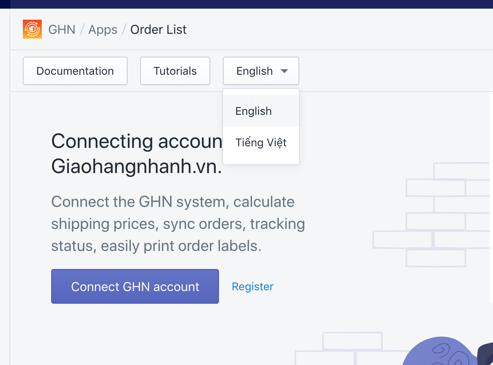
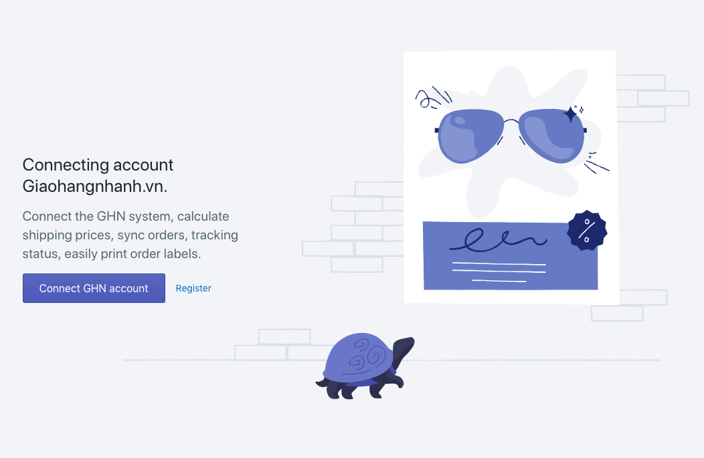
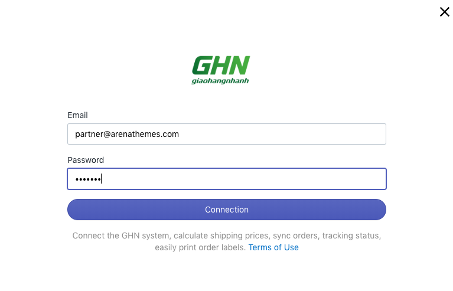
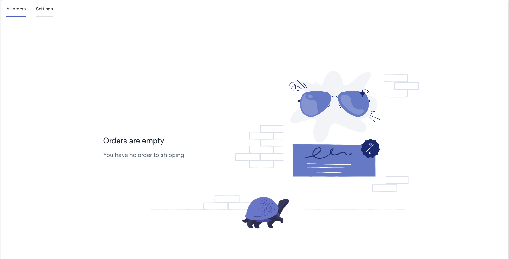

# Hướng dẫn tích hợp GHN Express với ứng dụng GHN

Sau khi hoàn thành cài đặt ứng  GHN app, chủ cửa hàng Shopify cần thực hiện liên kết đến tài khoản Giao hàng nhanh GHN Express để ứng dụng có thể cập nhật giá tự động cũng như chuyển thông tin đơn hàng trực tiếp từ Shopify sang GHN Express.

**Bước 1:** Từ Shopify admin, nhấn chọn vào **Apps.** Chọn **GHN.**

Tại đây bạn có thể chuyển đổi ngôn ngữ của ứng dụng sang Tiếng Việt bằng cách nhấn chọn vào nút tùy chọn ngôn ngữ : English sau đó chọn Tiếng Việt

**Bước 2:** Nhấn chọn **Connect GHN Account / Kết nối tài khoản GHN**

 **3: Điền thông tin tài**  [**GHN Expres**](http://doc.radaship.com/#register)**s** và nhấn chọn **Connection / Kết nối.**  

**Bước 4:** việc kết nối Shopify và GHN Express đã hoàn tất. Bạn có thể thấy danh sách đơn hàng để xử l khi truy cập ứng dụng GHN.

\*\*\*\*🇻🇳 **Khách hàng khi mua hàng từ Shopify có thể chọn phương thức vận chuyển từ GHN Express với mức giá được tính tự động sau khi bạn đã hoàn tất kết .**

