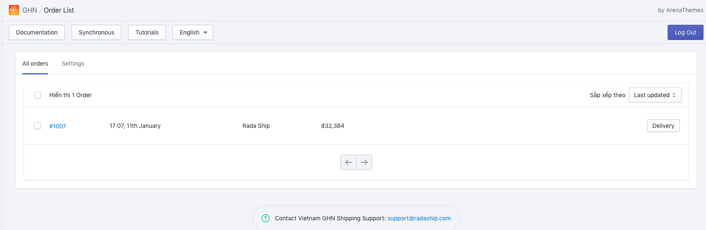
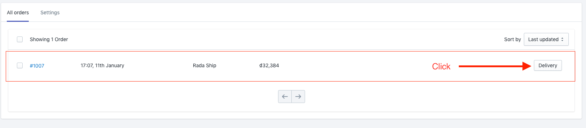
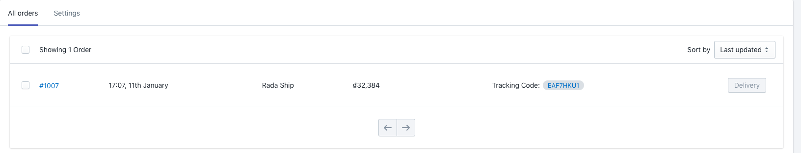
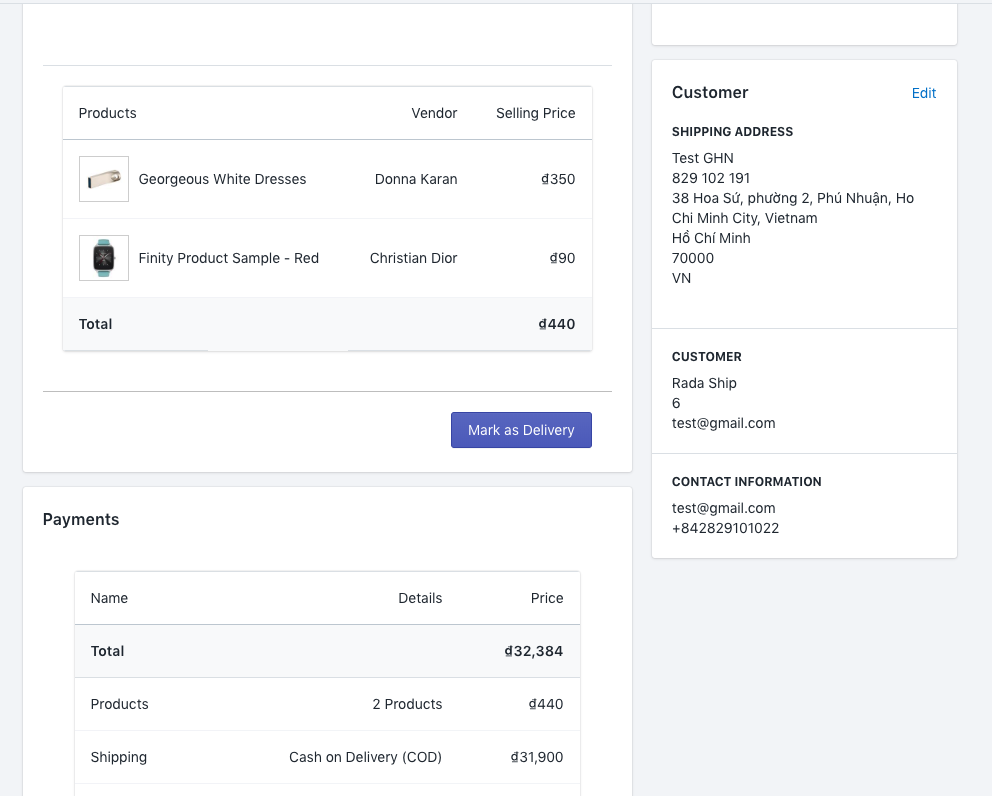
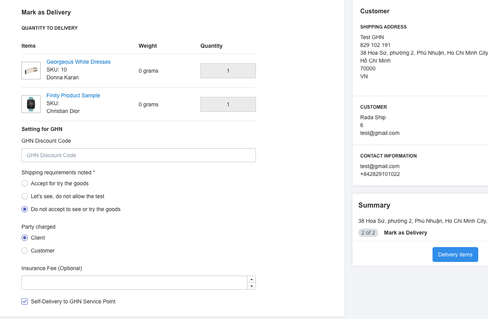
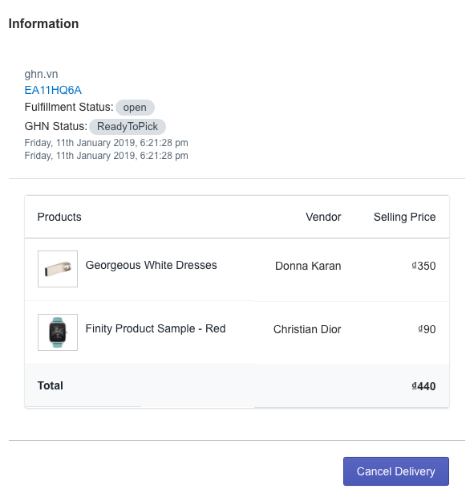
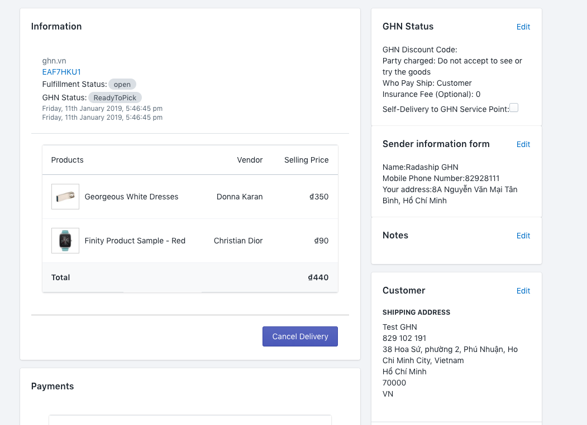
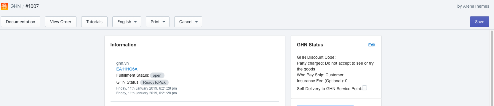
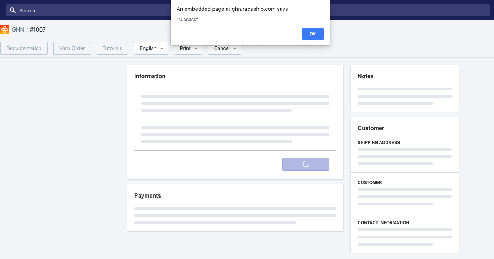

# Quản lý vận chuyển

Giao hàng nhanh cung cấp một số tùy chọn dịch vụ do vậy để có thể gửi đơn hàng trực tiếp từ Shopify sang Giao hàng nhanh bạn cần phải cài đặt những tùy chọn này trước. Cài đặt này sẽ là tùy chọn dịch vụ được sử dụng mặc định cho tất cả các đơn hàng.

### 1. Cài đặt tùy chọn dịch vụ.

**Bước 1:**  Từ trang quản lý ứng dụng **GHN chọn Settings / Cài đặt.**  

**Bước 2 :** Điền và chỉnh sửa thông tin cài đặt dịch vụ Giao hàng nhanh  

* Mã giảm giá GHN mặc định
* Chọn người thanh toán phí đặt hàng \(\*\)
* Lưu ý giao hàng.
* Gửi hàng tại điểm giao dịch.

**Bước 3**:  Chọn **Lưu**

### 2. Xác nhận đơn hàng và chuyển  GHN Express

Bạn có thể gửi đơn hàng qua GHN Express theo 2 cách.

#### 2.1. Gửi nhanh không cần xác nhận lại thông 

Trong trường hợp đơn hàng của bạn sử dụng các thông tin dịch vụ đã cài đặt ở trên và không có gì thay đổi trong nội dung thông tin của đơn hàng, thông tin khách hàng bạn có thể thực hiện như sau để gửi đơn hàng cho GHN Express nhanh  

**Bước 1:** Từ trang quản lý ứng dụng GHN bạn có thể thấy danh sách đơn hàng đang cần xử lý. Tìm đơn hàng cần xử lý.

**Bước 2:**  Chọn **Delivery / Gửi nhanh** để gửi đơn hàng của bạn sang GHN 

**Bước 3:** Đơn hàng đã được gửi đi thành công. Tracking của GHN Express sẽ được cập nhật ngay lập tức tại vị trí của đơn hàng.

#### 2.2. Tùy chỉnh đơn hàng trước khi gửi sang GHN 

Áp dụng trong trường hợp:

* **Bạn cần kiểm tra lại đơn hàng và chỉnh sửa thông tin** trước khi gửi sang GHN Express.
* Bạn cần chỉnh sửa các thông tin tùy chọn dịch vụ cho đơn hàng riêng lẻ khác với các tùy chọn chung đã được cài đặt ở phần trên.

**Bước 1:** Từ trang quản trị GHN, chọn vào đơn hàng bạn muốn xác nhận chỉnh sửa thông tin.

**Bước 2:** Thông tin đơn hàng sẽ được hiện ra và bạn cần kiểm tra lại thông tin của đơn hàng có chính xác không. Bạn có thể chỉnh sửa thông tin của **Khách hàng, Lưu ý khi vận chuyển** bằng cách nhấn vào nút Sửa ở các mục này.

**Bước 3:** Sau khi xác nhận chỉnh sửa xong thông tin bạn nhấn nút **Lưu**. Sau khi quay lại bảng thông tin đơn hàng, để chuyển đơn hàng đi bạn nhấn vào nút **Mark as Delivery / GỬI ĐƠN** để tiếp 

**Bước 4:** Xác nhận và chỉnh sửa thông tin các tùy chọn dịch vụ của đơn hàng tại mục **Cài đặt cho GHN** 

**Bước 5:** Chọn **Delivery items / Gửi đơn** để gửi đơn hàng sang GHN 

**Bước 6:** Thông tin tracking của đơn hàng sẽ được cập nhật ngay.

### 3. **Chính sửa thông tin đơn hàng đã gửi sang GHN** 

Trong trường hợp bạn đã gửi đơn hàng sang Giao hàng nhanh, tuy nhiên Giao hàng nhanh chưa xử lý đơn hàng này thì bạn vẫn có thể thay đổi cập nhật và chỉnh sửa thông tin của đơn hàng cũng như Hủy đơn.

**Bước 1:** Từ trang quản lý ứng dụng GHN, chọn đơn hàng đã gửi đi bạn muốn cập nhật.

**Bước 2:** Trang thông tin đơn hàng đã được gửi sẽ được hiện ra, bạn cần kiểm tra thông tin.

**Bước 3:** Chỉnh sửa thông tin thông qua nút **Edit / Sửa** sau đó chỉnh sửa thông tin và **Lưu.**

**Bước 4:** Nhấn nút **Save / Lưu** ở phần phía góc phải trên cùng của ứng dụng để cập nhật thông tin vận chuyển.

Thông báo cập nhật thành công sẽ được hiện ra sau đó.

### 4. Hủy đơn

Trong trường hợp bạn đã gửi đơn hàng sang Giao hàng nhanh, tuy nhiên Giao hàng nhanh chưa xử lý đơn hàng này thì bạn vẫn có thể thay đổi cập nhật và chỉnh sửa thông tin của đơn hàng cũng như Hủy đơn.

Bước 1: Từ trang quản trị ứng dụng GHN, chọn đơn hàng bạn muốn hủy đơn.

**Bước 2:** Trang thông tin đơn hàng sẽ hiện ra, bạn chỉ cần nhấn chọn Cancel Delivery / Hủy đơn

**Bước 3:** Thông báo hủy đơn hàng thành công sẽ hiện ra, bạn đã hoàn tất quá trình hủy đơn.

